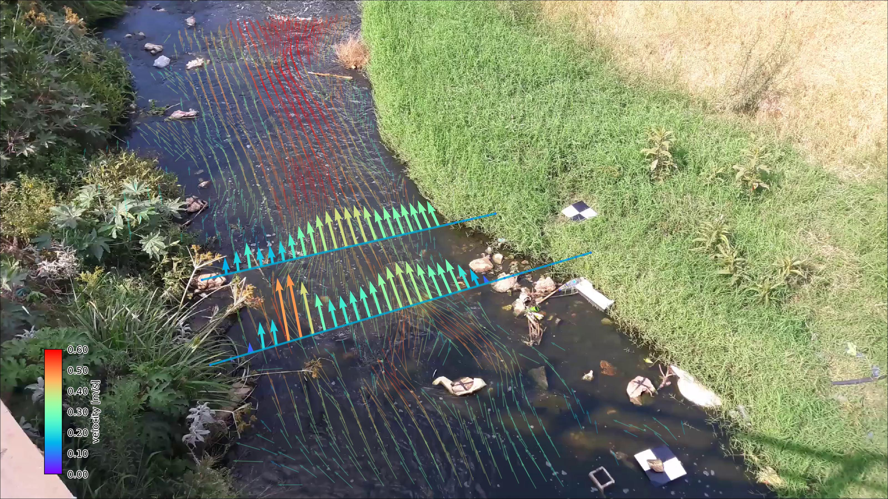

pyOpenRiverCam
==============

[](https://mybinder.org/v2/gh/localdevices/pyorc.git/main?labpath=examples)

**pyorc**, short for "pyOpenRiverCam" is a fully Open Source library for performing image-based river flow analysis. It is the underlying library for 
computations on the fully open software stack OpenRiverCam. **pyorc** can only be successful if the underlying methods
are made available openly for all. Currently **pyorc** implements Large-scale Particle Image Velocimetry (LSPIV) based
flow analysis using the OpenPIV library and reprojections and image pre-processing with OpenCV. We wish to extend this 
to Large-scale Particle Tracking Velocimetry (LSPTV) and Space-Time Image Velocimetry (STIV) for conditions that are less favourable for LSPIV once open
libraries with API to perform this are available. 


Image: Example of pyorc velocimetry over Ngwerere river at the Zambezi Road crossing - Lusaka, Zambia.

Current capabilities are:
* Reading of frames and reprojection to surface
* Velocimetry estimation at user-defined resolution
* Discharge estimation over provided cross-section
* Plotting of velocimetry results and cross-section flows in camera, geographical and orthoprojected perspectives.

We use the well-known **xarray** data models and computation pipelines (with dask) throughout the entire library to 
guarantee an easy interoperability with other tools and methods, and allow for lazy computing. 

We are seeking funding for the following frequently requested functionalities:
* A command-line interface for processing single or batch videos
* Implementation of better filtering in pre-processing
* Improved efficiency of processing
* Establishing on-site edge computation through a raspberry-pi camera setup
* Implementation of additional processing algorithms (STIV and LSPTV)

If you wish to fund this or other work on features, please contact us at info@rainbowsensing.com.

> **_note:_**  For instructions how to get Anaconda (with lots of pre-installed libraries) or Miniconda (light weight) installed, please go to https://docs.conda.io/projects/conda/en/latest/

> **_manual:_** A full manual with examples is forthcoming.

> **_compatibility:_** At this moment **pyorc** works any video compatible with OpenCV.

Installation
------------

To get started with **pyorc**, we recommend to setup a python virtual environment. 
We recommend using a Miniconda or Anaconda environment as this will ease installation, and will allow you to use all
functionalities without any trouble. Especially geographical plotting with `cartopy` can be difficult to get installed. 
With a `conda` environment this is solved. We have also conveniently packaged all dependencies for you. 
In the subsections below, you can find specific instructions. 

### Installation for direct use

If you simply want to add **pyorc** to an existing python installation or virtual environment, then follow these 
instructions.

First activate the environment you want **pyorc** to be installed in (if you don't care about virtual environments, then 
simply skip this step)

Then install **pyorc** as follows:
```
pip install pyopenrivercam
```
That's it! You are good to go!

### Installation from code base

To install **pyorc** from scratch in a new virtual environment from the code base, go through these steps. Logical cases
when you wish to install from the code base are:
* You wish to have the very latest non-released version
* You wish to develop on the code
* You want to use our pre-packaged conda environment with all dependencies to setup a good virtual environment

First, clone the code with `git` and move into the cloned folder.

```
git clone https://github.com/localdevices/pyorc.git
cd pyorc
```

If you want, setup a virtual environment as follows:
```
conda env create -f environment.yml
```

Now install the **pyorc** package. If you want to develop **pyorc** please type
```
pip install -e .
```
If you just want to use the lates **pyorc** code base (without the option to develop on the code) type:
```
pip install .
```
That's it, you are good to go.

Using pyorc
-----------
To use **pyorc**, you can use the API for processing. A command-line interface is forthcoming pending funding. 
A manual is also still in the making.

Acknowledgement
---------------
The first development of pyorc has been supported by the World Meteorological Organisation - HydroHub. 

License
-------
**pyorc** is licensed under AGPL Version 3 (see [LICENSE](./LICENSE) file).

**pyorc** uses the following libraries and software with said licenses.

| Package                | Version  | License                            |
|------------------------|----------|------------------------------------|
| numpy                  | 1.21.4   | BSD License                        |
| opencv-python-headless | 4.5.4.60 | MIT License                        |                                                                                      
| openpiv                | 0.23.8   | GPLv3                              |                                                                                      
| matplotlib             | 3.5.1    | Python Software Foundation License |                                                               
| geopandas              | 0.10.2   | BSD License                        |                                                                                              
 | pandas                 | 1.3.5    | BSD License                        |                                                                                      

Project organisation
--------------------

    .
    ├── README.md
    ├── LICENSE
    ├── setup.py            <- setup script compatible with pip
    ├── environment.yml     <- YML-file for setting up a conda environment with dependencies
    ├── docs                <- Sphinx documentation source code
        ├── ...             <- Sphinx source code files
    ├── examples            <- Jupyter notebooks with examples how to use the API
        ├── ...             <- individual notebooks and folder with example data files
    ├── pyorc               <- pyorc library
        ├── ...             <- pyorc functions and API files

